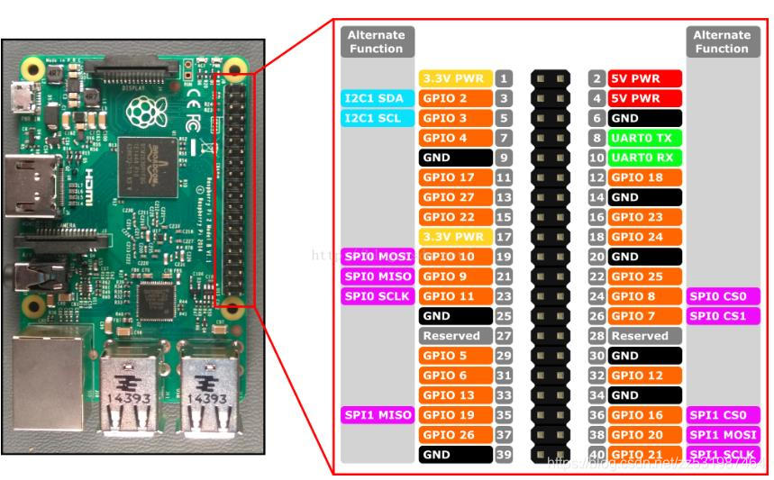

# Couple-PiFm

| BCM | Features |
|:---:|:--------:|
|  5  |    慢歌    |
|  6  |    万青    |
| 19  |    草东    |
| 26  |    但     |
| 12  |    循环    |
| 13  |    快歌    |
| 16  |   上一首    |
| 20  |   下一首    |
| 21  |   第一首    |

fmt prebuilt on `Linux rpi 5.15.92-1-MANJARO-ARM-RPI #1 SMP PREEMPT Mon Feb 6 22:02:34 UTC 2023 aarch64 GNU/Linux`